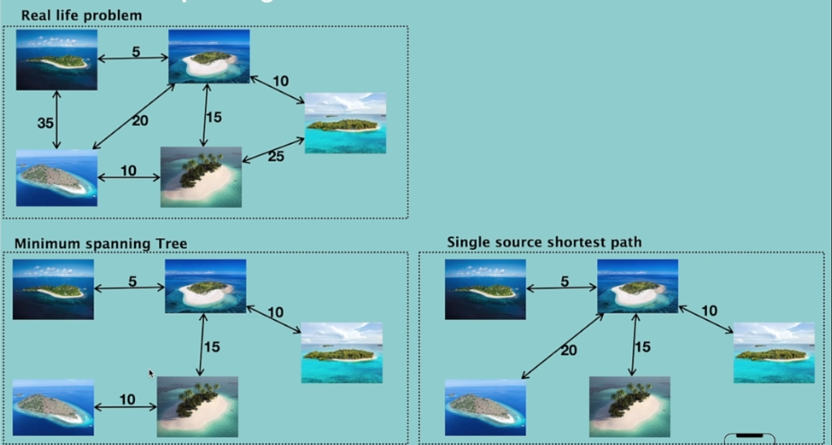
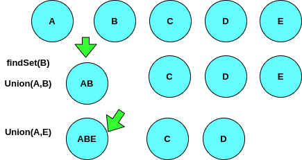

# Minimum Spanning Tree 🌳🌲

## What is MST?

- Collection of connected vertices **without cycle** in!
- Weighted edges
- **Goal:** find minimum cost to a target node

## Diference with SSSP?
In SSSP, we are looking for shortest path from a source node to **all** other nodes and there is a room for having a cylce; returning back to specific node over n over! However in MST, we are only looking for minimum cost, so we can't have a cycle. Take a look at img below to find out the difference;

## Disjoin Set

Before heading to implementation, let's take a look at Disjoin Set data structure. **Disjoint Set** is a data structure to keep track of a set of elements. In this case, we are keeping track of a set of vertices in a graph. Disjoint Set allows us to find out if two nodes are connected or not! We have three main operations:
- makeSet(N): used to create the initial set of N elements
- MakeUnion(x, y): used to merge two sets of elements
- FindSet(x): used to find the set of elements that x belongs to

