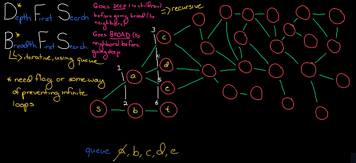

# Graph
Collection of nodes and edges!

## Difference with Tree:
Graph can have a cycle/loop in itself, whereas tree can't!

## How implement a graph in python?
- Using a dictionary to store nodes and edges.
- Each node is a dictionary with key: value pairs ---> all the nodes that are connected to that node!

## Graph Traversal Algorithms: visiting all the nodes in a graph!
- Depth First Search (DFS)
- Breadth First Search (BFS)

## BFS ---> wider/broader on surface!
Hey S, do ya have a path to t?

S: Hmm, lemme check each of nodes being t!

S: No, none of my nodes are t! So each of those nodes get in line (**queue a,b**) and then we ask second level nodes (c,d) and so on!

So we go level by level wider before we get deep! That's why we call it BFS!

**NOTE TO REMEMBER**:
When ya start asking "her S do ya have a path to t?" ya gonna go and add all it's children to the queue! And rather than going recursively, ya just pull out the first element(a) n check if it isn't t, then ya're gonna add all the next level children to the queue and so on!

## BFS desudo Code
1. Define a queue to store the nodes that are to be visited!
2. while queue is not empty:
    - pop the first node from the queue (Dequeue)
    - if the node has not been visited:
        - mark it as visited
        - add all the unvisited neighbors to the queue

Python code added to the `graph.py` file

## DFS ---> deep in the tree/ asking children for a path!
Hey Node X, do ya have a path to node Y? 

Node X: hmm, I'm not sure, lemme go and ask from my children!

Node X-child1: Hey child, do ya have a path to node Y? 

Node X-grandchild: Hmm, I'm not sure! Lemme go n ask from my child!

The process goes on and on and on, till we get to the target point! 
So as ya see DFS build with **Recursion**. 
But the problem with it is that it can get pretty tiring! Since maybe the target node is right next to the starting node, while we go deep in the trees children! So that's why we sometimes prefer to use **BFS**! 

**NOTE TO REMEMBER:** In order to avoid stuck in an infinite loop, we need a **flag** to make sure that we have visited a node!

- Implements using **Stack** (LIFO) and in **Recursion** matter!

- Types of **DFS**: Pre-order, In-order, Post-order

## DFS desudo Code
1. Define a stack to store the nodes!
2. Push any starting node to the stack!
3. while stack is not empty:
    - pop the first node from the stack 
    - if the node has not been visited:
        - mark it as visited
        - push all the unvisited neighbors to the stack!

## Summary

