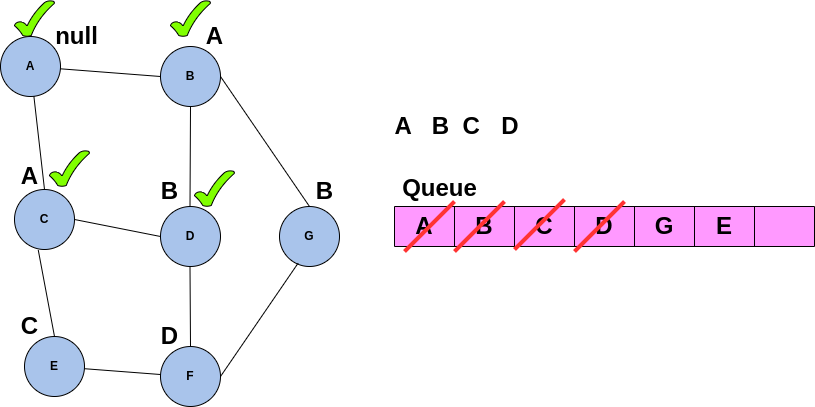

# Single Source Shortest Path Problem 

by defintion this problem stands for traversing thro (un)weighted graph starting at one vertex then getting to the the target vertex in a way that the cost(overal edge weight) of the path is minimum!

## Solution

This problem can be solved in 3 ways;
- **BFS**
- **Dijkstra's Algorithm**
- **Bellman-Ford Algorithm**

##  BFS Solution 🥳

As we discussed earlier in this article, **BFS** is a level-based traversal! The only difference between this BFS that we aim to use to solve the SSSPP problem is that we keep track of/save the parent of each node so that later we know which vertex is prior to the current one! In other words we would know, which path we have come from so far!



## BFS dsudeo Code 🤓

```
enque any starting point
while q is not empty:
    deque a vertex
    if vertex is unvisited:
    mark it as visited
    then enque all adjacent vertex of the selected vertex
    update the parent of the adjvertexes
```

## 🔥 Notice

**BFS** does not work on Weighted Graphs! 

