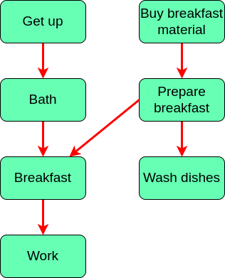
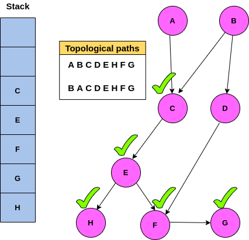

# Topological Sort
Used when we have a flow of actions, in a way that if there is a dependency of one action to another, the dependent action always comes after its parent!



So the question is , in case we have all this tasks, how one can recognize the order of them? 🤔 Well, we can use a **topological sort algorithm** comes in! See below to figure how....

## Dsudeo Code 😁

```
if a vertex depends on CurrentVertex:
go to that vertex untill there is no dependency
then get back to the CurrentVertex
else:
push the vertex to the Stack
```



