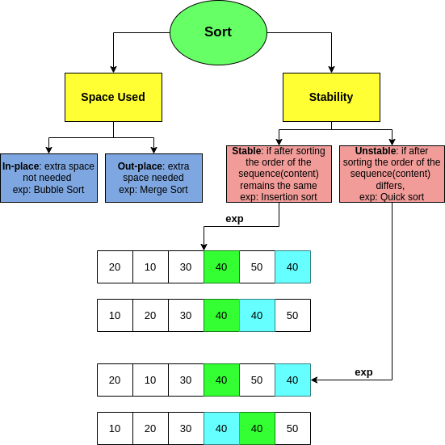
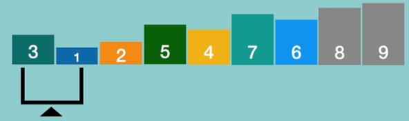
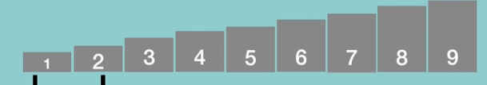
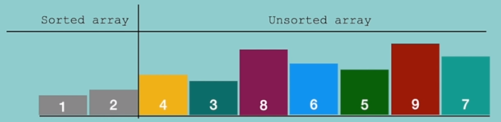

# Sorting Algorithms different types 🧮📊

## What is Sorting?
By definition, sorting refers to arranging the elements in either decending or ascending order! For instance, the following img size is not in right order, so we can use either of the sorting algorithms to make it sorted in right order!
Now, let's see an overview diagram of different types of sorting algorithms! 👇

## Sorting Terminology
- **Increasing Order:**
    - if a successive element is greater than the prev one!
    - exp: [1,2,3,4,5]
- **Decreasing Order:**
    - if a successive element is less than the prev one!
    - exp: [5,4,3,2,1]
- **Non-increasing order:**
    - if a successive element is equal or less than the prev one! **Note** that it is differenct from decreasing order! In this type, we have duplicate elements!
    - exp: [11,9,7,7,5,4] (9 is less than 11, 7 is less than 9,...)
- **Non-decreasing order:**
    - if a successive element is equal or greater than the prev one! **Note** that it is differenct from increasing order! In this type, we have duplicate elements!
    - exp: [4,5,6,6,7,8] 
    - **Note** that **NON** keyword means we have duplicate elements!

# Bubble Sort
- Repeatedly compare pairs to the end of sequence and swap them if they ain't in a right order!
- Continue comparing till all the elements are sorted
- very end elements are sorted! This means that the very last item is the biggest element and it is sorted!

**Code is added to the `Sort.py` file**

# Selection Sort
- We divide the array into 2 different category of Sorted n Unsorted Array!
- We continuosly find the **Minimum element** in the unsorted array n once found, **replace** it w/ the first element.
- expand the Sorted array list! So this way all the element till that last-added elemets are sorted!
- **idea:** every time we are finding the minimum element, move it to the first place in the array, then its considered as sorted! But it only works good on **small** size arrays that are in random order!

## When to use?
- When we have insufficient memory to store the whole array in memory!
- easy to implement!
- **Not** used when the time complexity matters!
**Code is added to the `Sort.py` file**

# Insertion Sort
- Pretty similar to the selection sort, but the difference is in Selection sort we find n pick them **min** element, however in insertion sort, we pick the first element!
**Code is added to the `Sort.py` file**

# Merge Sort
- divide n conquer problem untill the blocks become the smallest n can't be divided anymore!
- divide to 2 category
- call mergesort in each category
- merge back up!

## When to use it?
- Ya need a stable sort!
- Efficient time complexity of  O(log(n))

# Quick Sort
- divide n conquer algorithm!
- consider a pivot --> always choose the most right element as the pivot!
- all elements at the left side of the pivot gotta be smaller n all the elements at rite side of the pivot gotta be bigger! ---> Partition the array into 2 parts!

- **How?** 🤔
- Pick a pivot, then a left n right pointers. 
- Start comparing each of them w/ the pivot
    - if left pointer is greater or equal to the pivot then move 1 step left
    - if right pointer is smaller/equal to the pivot then move 1 step right 
    - if left n right pointers face each other, then swap that number w/ the pivot num! Then it will  be considered as fully sorted!
## When to use it?
- Time complexity of O(n log(n))
- **Not** used when ya need a stable sort! n space matters!

# Heap Sort
- It is similar to selection sort where we first find the maximum element and place the maximum element at the end. We repeat the same process for the remaining element.
- insert all the elements into a binary heap!
- then Extract/pop out the root/parent element!